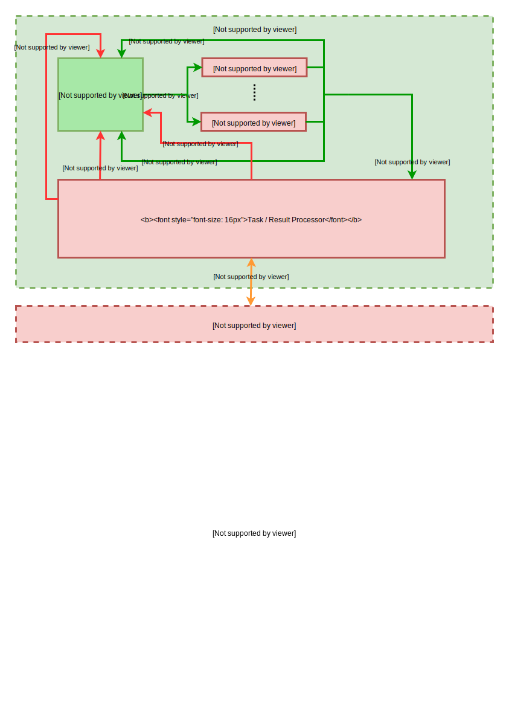

# Qt-MultiThreading

# Motivation

Qt does not provide support for using the Signals & Slots mechanism in combination with C++ templates. See: https://doc.qt.io/qt-5/why-moc.html

However: It is actually possible to do this, when one is willing to keep track of the things normally handled
by the QObject::connect() function and "call" slots with QMetaObject::invokeMethod().

Doing this has some nice side effects like not having to call qRegisterMetaType() or using the Q_DECLARE_METATYPE macro.

For a more detailed explanation take a look at the documentation of the invokeInContext() function in Magic.h

Furthermore does Qt provide mechanisms for threading, as being described here: https://doc.qt.io/qt-5/threads-technologies.html#choosing-an-appropriate-approach

**The case** "Have an object living in another thread that can perform different tasks upon request and/or can receive new data to work with"

**has the proposed solution** "Subclass a QObject to create a worker. Instantiate this worker object and a QThread. Move the worker to the new thread. Send commands or data to the worker object over queued signal-slot connections"

which implies not being able to use C++ templates, when relying solely on the native Signals & Slots mechanism.

But since I am lazy and don't like Copy & Paste, this framework provides a solution for handling that case in combination with C++ templates.

The main idea is to have "Tasks" and "Results", which are being described by template parameters "T" and "R" in this framework.

A Worker, which is running in his own thread, receives a task and responds with a result.

In general do you need to inherit from the Processor template class, the Worker template class
and implement at least the pure virtual methods to create the functionality you want and give instances of those
new classes to a Controller. That's it.

In order to be able to start working on new tasks, change the number of threads to use etc. you need a communication channel
to the instance of the Processor.

You may use Qt Signals & Slots or use the ~~invokeInContext() function~~ Signals & Slots mechanism of this framework.
The first example in `src/examples/one/` covers all of that.

The second example in `src/examples/two/` focuses only on the Signals & Slots system of this framework.

A third example in `src/examples/three/` shows usage of the threading architecture + Signals and Slots of this framework
completely without using Qt Signals and Slots.

# System architecture

# Usage of the framework
Everything you need is documented in the `CMakeLists.txt`.

If you don't know what to do with such a file, you should use a search engine to find out.

# Documentation
Use the `Doxyfile` to generate the documentation via `Doxygen`.

# Example usages

Look into the `src/examples/` folder.
